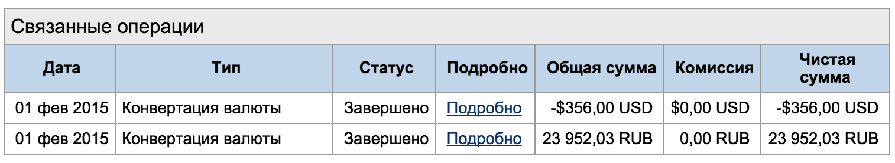
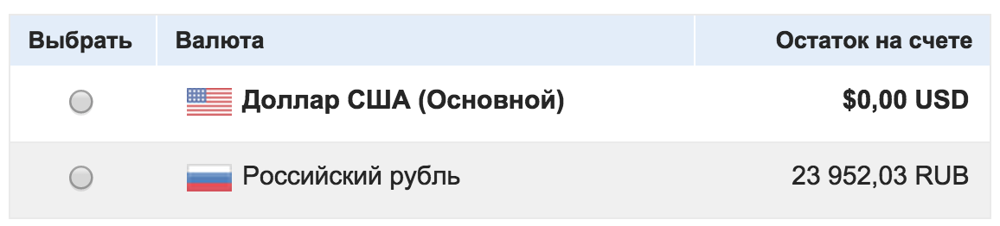
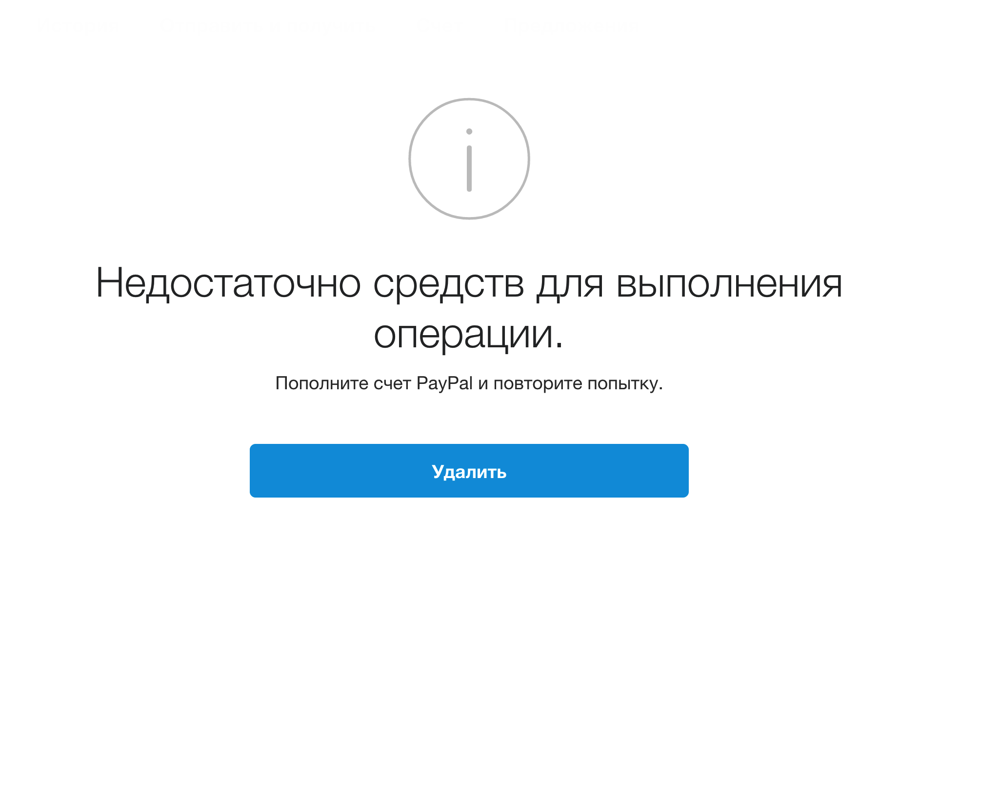
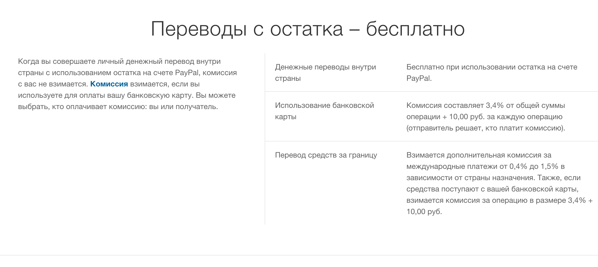
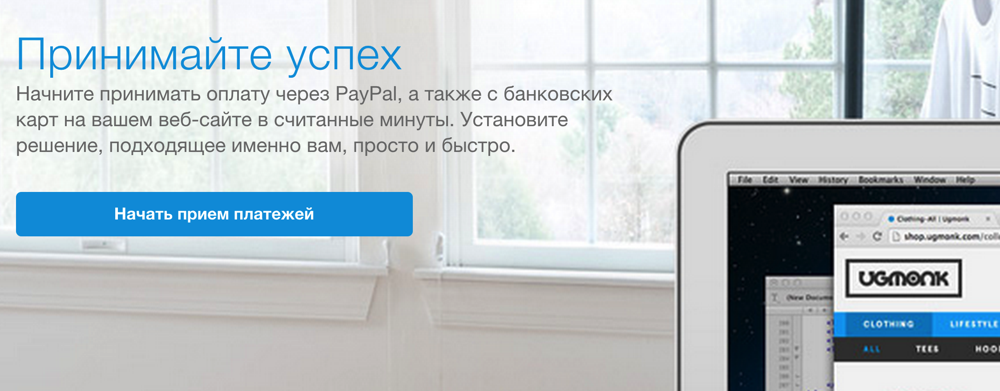

# PayPal, исправь PayPal-Россия

Будучи обычным студентом-программистом, до нового года я немного подработал на иностранного заказчика (11 часов), что по моей ставке составило 220$. Решив с заказчиком, что лучшим вариантом оплаты заказа будет PayPal, я зарегистрировался на сервисе, но я даже и не представлял, как дорого это мне обойдется.

## Первая попытка совершить оплату

Говоря короче, заказчик не стал разбираться в тонкостях перевода и выполнил транзакцию через сервис ODesk.

## Пересылка с ODesk в PayPal

Проработав еще немного, я решил проверить оплату на PayPal.

Каково же было мое удивление, когда я обнаружил в принятом платеже такие строки:



Сначало я не поверил своим глазам, потому зашел на "Управление валютами":



Очевидно, что деньги были бы зачислены в графе "Доллар США (Основной)", но графа остатка указывала на обратное.


## Поддержка, я иду!

Логично, что с первым же письмом в техподдержку сервиса я пытался узнать, почему имел место автоматический перевод суммы в рубли:

```
$ был выставлен как стандартная валюта в счете за неделю до получение платежа
Пришло ###$ который конвертировались в рубль
Прошу отменить это и исправить проблему ибо это считаю недопустимым c вашей стороны.
```

Ответ не заставил себя долго ждать:

```
Если Ваш счет еще не прошел проверку, Вы можете держать средства только в рублях. При получении средств в иностранных валютах, они будут автоматически конвертироваться в рубли.

Для получения статуса проверенного пользователя войдите в свою учетную запись PayPal и нажмите «Проверить лимиты своего счета»,  затем  «Увеличить лимиты».

Вы будете автоматически перенаправлены на страницу, где сможете выполнить все требуемые действия.  Нажмите «Начать» рядом с каждым требованием и следуйте инструкциям.

Когда все требуемые действия будут выполнены, лимиты на отправку/получение средств будут составлять:

550 000 руб. за операцию
Ежемесячный лимит отменен
Примечание.
Предоплаченные карты не могут использоваться для получения статуса проверенного пользователя и для повышения лимитов на отправку средств.

Мы всегда рады помочь. Спасибо за использование услуг PayPal.
```

Настараживает меня во всём этом то, что я ни разу не увидел ни указания самого ограничения, ни какого-либо уведомления. 

В [Соглашении с пользователем в отношении услуг PayPal](https://www.paypal.com/ru/webapps/mpp/ua/useragreement-full) я нашел такой пункт:

```
2.4. Ограничения для физических лиц

a. a. остаток на вашем счете может быть только в рублях и не может превышать 15 000 рублей в любой момент времени;
```

Перечитав его трижды, я заметил, что правило имеет союз 'и', что позволяет мне разделить это условие на два:

> остаток на вашем счете может быть только в рублях

Выполнено автоматически;

> не может превышать 15 000 рублей в любой момент времени

На счету уже было 23 тысячи рублей, что недопустимо по условиям оферты, поэтому платеж от ODesk должен был закончиться со статусом "не проведен", а деньги не могли быть приняты на счёт в PayPal, что, собствено, можно было наблюдать в первой части статьи, где иностранный заказчик не мог отослать мне мои первые 220$.

Ладно, когда компания отступается против своих же правил, однако слать оферту с ошибкой в том же пункте я считаю недопустимым.

Однако, спустя несколько сообщений я снова получил ответ вида:

```
Здравствуйте, Пацура Дмитрий!

Благодарим за обращение в PayPal.
Наши юридические соглашения гласят:

........

Мы всегда рады помочь. Спасибо за использование услуг PayPal.

....
```

Сразу после получения письма мне стало ясно, что решить данную проблему через тех. поддержку мне будет невероятно сложно, а может даже и не возможно.

## Русская локализация

Очень смешно было видеть ляпы в таком продукте.

> "Удалить" вместо "Отмена".



> "Остаток" вместо "баланс" или "счет".



> "Принимайте успех" вместо принимайте терафлю ;)  (???)



## Выводы

В мире много сервисов, не лишённых недостатков, но всё-таки самыми главными в развитии этих сервисов
являются решения как в политике, так и в рассмотрении спорных моментов и устпи  (???)  пользователям.

Для того, чтобы компания обратила большее внимание на проблемы PayPal в России, предлагаю поддержать волну в твиттере:

```twt
@PayPal fix @PayPalRu
```
